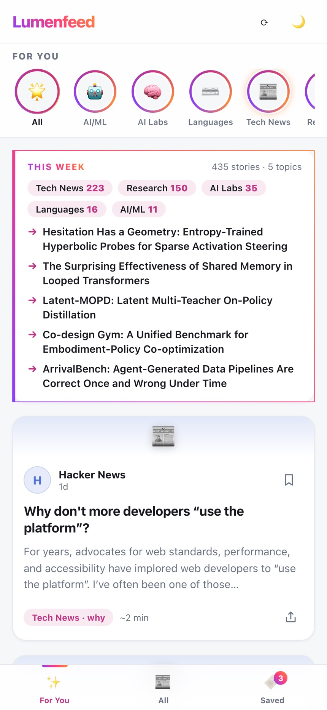
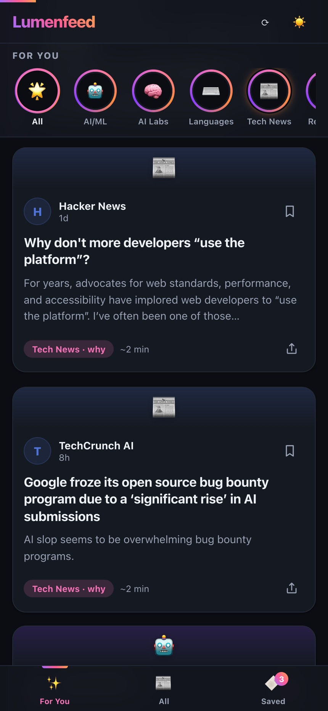
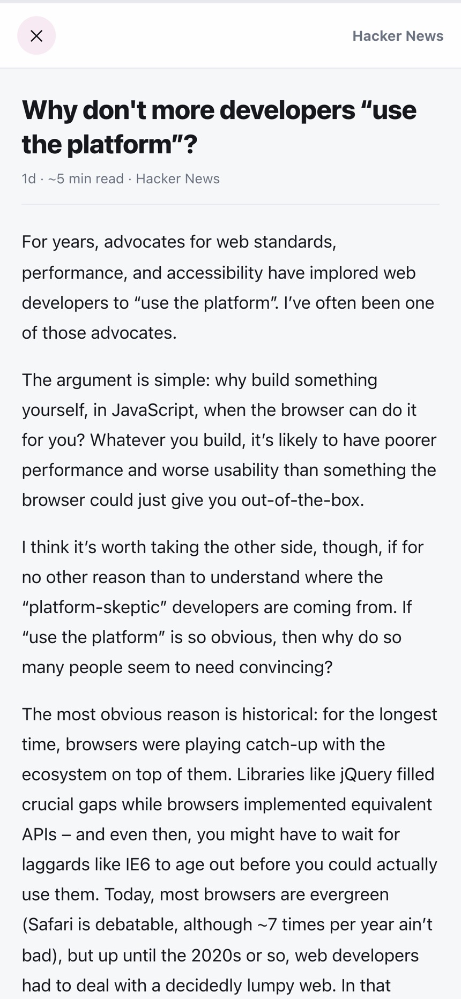
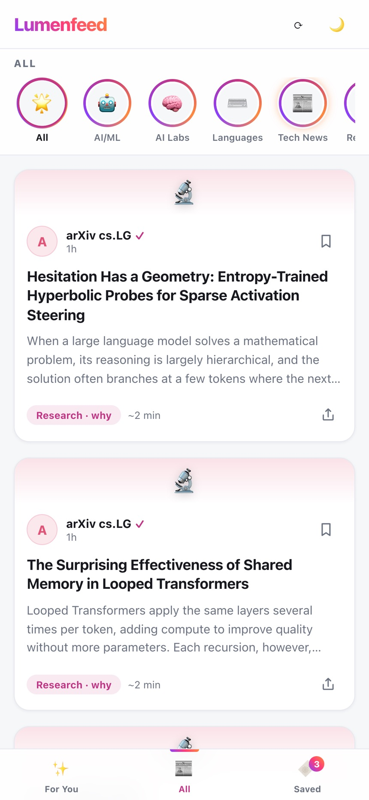
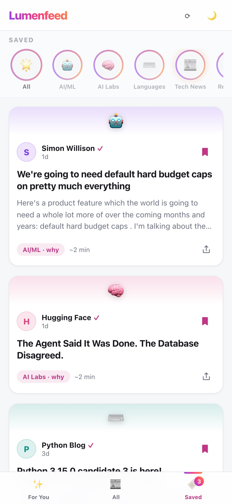
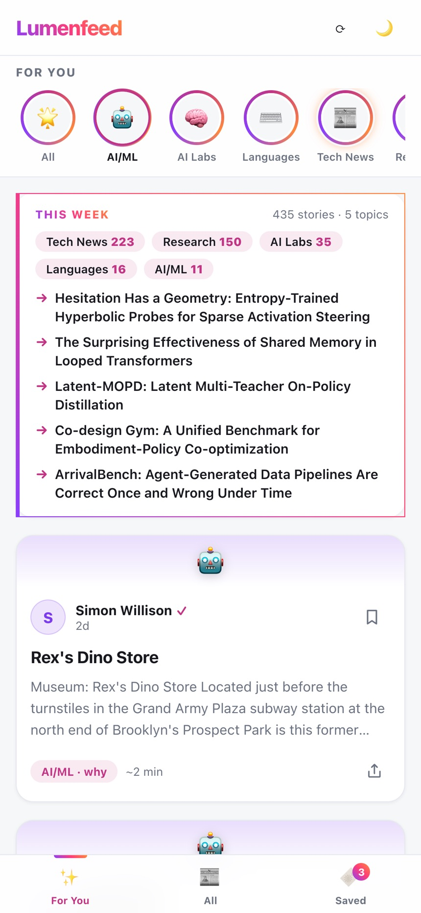
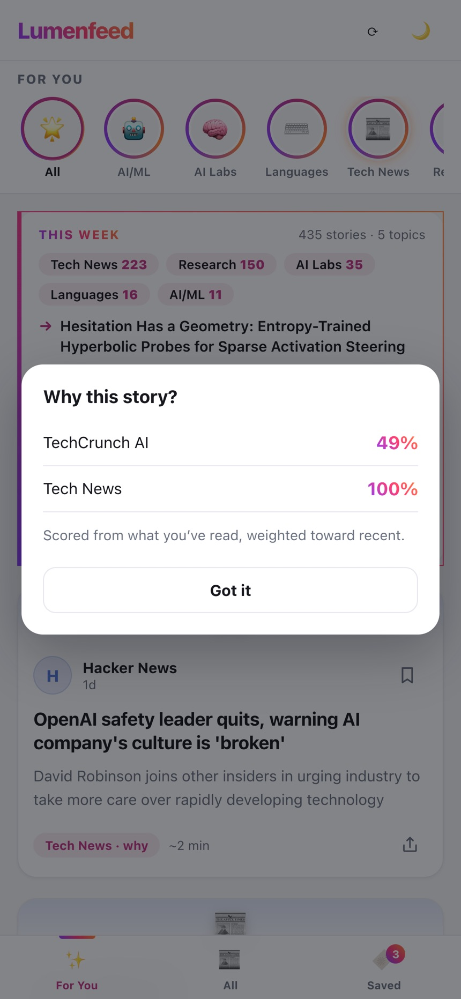

# Lumenfeed

[](LICENSE)
[](https://github.com/sanjaygulati13/lumenfeed/actions/workflows/ci.yml)
[](https://www.python.org/)

> A feed that scrolls like your social app but actually teaches you stuff.

<p align="center">
  
  
</p>

I spent too much time scrolling YouTube, Instagram and other social media feeds and realized I wasn't learning anything that I really want (apart from cleaning hacks and recipes). But the *scrolling* wasn't the problem. The content was.

So I built this: a self-hosted feed of tech/AI writing (lab blogs, papers, engineering posts) with the same infinite-scroll, one-tap-save, swipe-to-dismiss UX. It refreshes every 30 min, learns what you read, and re-ranks accordingly. Runs on your machine, SQLite for storage, no account needed.

Ships with 19 sources I actually follow and find useful. You can add your own in one file.

<details>
<summary>More screenshots</summary>
<br>

| Reader | All | Saved | Filtered to AI/ML | "Why this story?" |
|:------:|:---:|:-----:|:-----------------:|:-----------------:|
|  |  |  |  |  |

</details>

## What is bundled

- 19 sources to start with: a few personal blogs (Lilian Weng, Simon Willison, Chip Huyen, Jay Alammar), the big AI labs, the Rust/Go/Python blogs, Hacker News, TechCrunch and arXiv cs.LG. The full list is in `lumenfeed/sources.py`.
- Two tabs. **All** is newest first with every source mixed together. **For You** gets re-ranked based on what you actually open.
- A summary on every card, no LLM involved. When a feed doesn't include a decent description, Lumenfeed grabs the page's meta description or first few paragraphs and caches it.
- Tap a card to read the article inside the app. Double-tap to save, long-press for share / copy link / open original, swipe left for "less of this".
- A "This week" card at the top of For You, and a row of category filters.
- Dark mode. You can add it to your phone's home screen and it behaves like an app (there's no offline mode yet).
- One small Python package plus a single HTML file. No build step, no JS framework, nothing pulled from a CDN.

## Why not just use an RSS reader?

Miniflux, FreshRSS, NewsBlur, wallabag — all great tools. But they all assume *you* pick the feeds and *you* manage them.

I tried them but did not want another inbox to keep at zero. Here the default sources come bundled, you open it, scroll, read whatever looks interesting, and the feed adjusts. The ranking is a short formula you can read (below), and what you read never leaves your machine.

If you need a feed that’s tailored to your sources, ranks based on your preference and gives you knowledge you want then use this.

## Getting started

You need Python 3.10 or newer.

```bash
git clone https://github.com/sanjaygulati13/lumenfeed.git
cd lumenfeed
make install
make run
```

Open http://localhost:5024. On the very first start the database is empty, so give it a minute to pull everything in.

No `make`? This does the same thing:

```bash
python3 -m venv .venv
source .venv/bin/activate
pip install -e .
lumenfeed
```

### With Docker

```bash
git clone https://github.com/sanjaygulati13/lumenfeed.git
cd lumenfeed
docker compose up -d
```

Same address, http://localhost:5024. Your reading history lives in the `lumenfeed-data` volume, so it survives rebuilds and upgrades (`git pull && docker compose up -d --build`).

### On your phone

This is how I use it most of the time. By default it only listens on 127.0.0.1, so start it like this instead:

```bash
make run HOST=0.0.0.0        # or: LUMEN_HOST=0.0.0.0 lumenfeed
```

With Docker, change the port line in `compose.yaml` from `"127.0.0.1:5024:5024"` to `"5024:5024"` instead.

Then open `http://<your computer's IP>:5024` on your phone and add it to the home screen.

There's no login. Once it's listening on 0.0.0.0, anyone on your Wi-Fi can open it, which is fine at home. If you want to reach it from outside, put something with auth in front of it (Tailscale, Cloudflare Access, a reverse proxy with basic auth). Please don't just forward the port.

## Settings

Everything is optional and set through environment variables.

| Variable | Default | What it does |
|----------|---------|--------------|
| `LUMEN_HOST` | `127.0.0.1` | Address to listen on. `0.0.0.0` for your LAN |
| `LUMEN_PORT` | `5024` | Port |
| `LUMEN_DATA` | `./data` | Where the SQLite database lives |
| `LUMEN_REFRESH` | `1800` | Seconds between feed refreshes |
| `LUMEN_TIMEOUT` | `20` | Timeout in seconds for every outgoing request |
| `LUMEN_ENRICH` | `1` | Set to `0` to stop fetching article pages for summaries |
| `LUMEN_ENRICH_LIMIT` | `20` | How many summaries to backfill per refresh |
| `LUMEN_ENRICH_DELAY` | `0.2` | Pause between those fetches, so we're not hammering anyone |
| `LUMEN_PER_SOURCE_CAP` | `0` | Max stories from one source per For You page. `0` picks one for you (about a fifth of the page) |
| `LUMEN_PREF_GAMMA` | `0.5` | How much to flatten your favorite source's lead. `1.0` turns it off |

`make run` ignores `LUMEN_HOST`/`LUMEN_PORT` and takes `HOST=` and `PORT=` instead.

## Adding a source

Add an entry to `lumenfeed/sources.py`:

```python
{
    "name": "My Favorite Blog",
    "category": "AI/ML",  # AI/ML, AI Labs, Languages, Tech News, Research, Physical AI
    "url": "https://example.com/feed.xml",
}
```

If the site has no feed, add `"type": "scrape"` and point `url` at the page that lists the posts. The scraper is best effort, so look at what it pulls in before you rely on it. There's also `"type": "rsc"`, which is written specifically for Anthropic's news page (it digs the post list out of the Next.js payload). I wouldn't expect it to work anywhere else.

Stick to the six categories above, because the filter row in the UI is hardcoded to them. Restart the server and hit refresh to see the new source.

## How For You ranks things

Every time you open a story, Lumenfeed writes down the source, the category and the time. Older reads count for less: a read from 30 days ago is worth half of one from today. Your most-read source gets a score of 1.0 and everything else is relative to it, then square-rooted so one source you read constantly doesn't push everything else to zero.

Each story then gets:

```
score      = 0.7 × preference + 0.2 × recency + 0.1 × exploration
preference = 0.6 × source score + 0.4 × category score
```

plus a little random jitter so the order isn't identical every time you open it. Exploration is higher for sources you rarely read. Swiping a story away halves its source's score; do it twice and that source drops to 5%. Finally the page gets filled round-robin with a cap per source, so Hacker News can't take 10 of the 12 slots.

Things you've read or swiped away don't come back. Tap "why" on any card to see the numbers behind it.

All of this runs locally. Your reading history sits in `data/articles.db`, and the only network traffic is fetching feeds and article pages.

## Known rough edges

- arXiv publishes its whole daily batch with the same timestamp, so right after it updates, the All tab is a wall of papers. For You is fine because of the per-source cap.
- Scraped sources (Mistral, Anthropic) break whenever those sites change their markup. If one goes quiet, look for `Scrape failed` in the logs.
- hnrss.org has the occasional outage. Hacker News comes back on the next refresh after it recovers.

## Keeping it running

Other `make` targets:

```bash
make dev         # run with auto-reload
make test        # run the tests (no network needed)
make clean       # remove .venv and caches (your data/ stays)
make clean-data  # delete data/, which wipes your reading history and saves
```

To run it as a systemd user service (no root needed):

```bash
mkdir -p ~/.config/systemd/user
cp deploy/lumenfeed.service ~/.config/systemd/user/
# fix the paths in the file to point at your clone, and change --host if you want LAN access
systemctl --user daemon-reload
systemctl --user enable --now lumenfeed
sudo loginctl enable-linger "$USER"   # keep it running after you log out
```

## API

The frontend talks to a small JSON API, in case you want to script against it. FastAPI also serves interactive docs at `/docs`.

| Method | Endpoint | Notes |
|--------|----------|-------|
| `GET` | `/api/articles?mode=all` | Newest first. Page with `after_ts` and `after_id` from the last item |
| `GET` | `/api/articles?mode=personalized` | For You. Page with `exclude=` and the ids you already have |
| `GET` | `/api/articles?category=AI/ML` | Works with either mode |
| `GET` | `/api/articles/{id}/summary` | Summary, fetched from the page if the feed's was too thin |
| `GET` | `/api/articles/{id}/content` | Article text for the reader |
| `POST` | `/api/articles/{id}/read` | Mark as read |
| `POST` / `DELETE` | `/api/articles/{id}/save` | Save / unsave |
| `POST` | `/api/articles/{id}/dismiss` | Hide it. `kind=source` (default) also ranks the source lower, `kind=article` doesn't |
| `GET` | `/api/saved`, `/api/saved/count` | Saved stories, and how many there are |
| `GET` | `/api/digest` | Data for the "This week" card |
| `GET` | `/api/preferences` | Your current source and category scores |
| `POST` | `/api/refresh` | Fetch everything now. Does nothing if a refresh is already running |

## Finding your way around the code

- `lumenfeed/sources.py` is the source list.
- `feeds.py` fetches RSS, scrapes the sites without feeds, and parses dates.
- `enrich.py` builds summaries and the reader text.
- `personalization.py` is the ranking.
- `api.py` has the routes, `jobs.py` the background refresh.
- `templates/index.html` is the entire frontend.
- `tests/test_app.py` uses a throwaway database and never touches the network.

## Ideas

Things I'd like to get to at some point:

- [ ] Offline reading
- [ ] Optional login, so it's safe to put on the internet
- [ ] Tags / keyword-based preferences (right now it's only source + category)
- [ ] Multiple profiles (work stuff vs. random curiosity)
- [ ] Optional local-LLM summary rewrite (probably overkill but fun)
- [ ] A notification when a favorite source posts something new

## Contributing

See [CONTRIBUTING.md](CONTRIBUTING.md). Adding a source is the easiest way in.

## License

[MIT](LICENSE)
